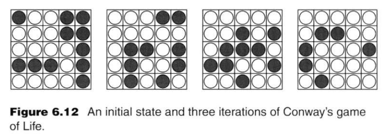

### Problem description
In 1970, Princeton mathematician John Conway invented the game of Life. Life is an example of a cellular automaton. It consists of a rectangular grid of cells. Fach cell is in one of two states: alive or dead The game consists of a number of iterations. During each iteration a dead cell with exactly three neighbors becomes a live cell. A live cell with two or three neighbors stays alive. A live cell with less than two neighbors or more than three neighbors becomes a dead cell. All cells are updated simultaneously. Figure 6.12 illustrates three iterations of Life for a small grid of cells. Write a parallel program that reads from a hie an m x n matrix containing the initial state of the game. It should play the game of Life for j iterations, printing the state of the game once every k iterations, where j and k are command-line arguments. 


### build matrix
```
gcc -Wall -o buildMatrix buildMatrix.c
./buildMatrix
```

### Compile & run lifeGame.c
```
mpicc -Wall -o a.out lifeGame.c
mpirun -np x ./a.out matrix.bin
```

